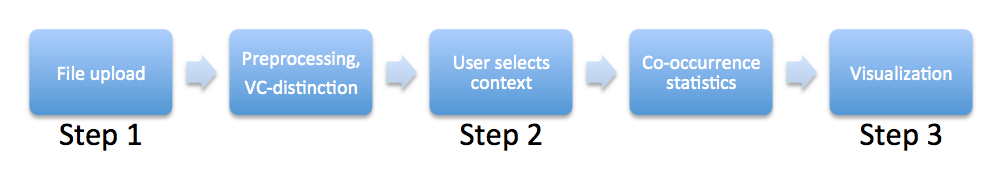

# PhonMatrix
Visualizing phonological patterns such as vowel harmony and similar place avoidance from language data. The application can be accessed here: <a href="http://phonmatrix.herokuapp.com/" target="_blank">http://phonmatrix.herokuapp.com/</a>.

# Description

PhonMatrix is a web-based visualization tool that statistically analyzes sound co-occurrences within words and displays the result in a symmetric sound matrix.

In the first step, the user has to upload the text file containing the word list that serves as the input to the analysis process. Text files have to be encoded in UTF-8 and list only one word per line. For a meaningful analysis the words should be given in some phonemic transcription (e.g., using IPA).

In the second step, the user can make changes to the automatic classification of symbols into vowels and consonants and exclude infrequent symbols from further consideration.

In the third step, the results of the statistical analysis of the co-occurrence counts are displayed in a quadratic matrix of sounds. The rows and columns of the matrix represent the individual sounds that are relevant for the selected context (e.g., vowels in the context of VCV sequences). The rows thereby stand for the first members of the relevant sound pairs, whereas the columns contain the sec- ond members. Each cell of the matrix then shows the result for the pair of sounds in the respective row and column.

The final result is a visualization of the co-occurrence matrix with rows and columns sorted according to the similarity of the sound vectors and statistical values represented as colors in the matrix cells. The visualization features a number of interactive components that facilitate the detection of potential patterns in the results by the user.

# Requirements for input files

- UTF-8 character encoding
- one word per line
- File size max. 3MB

# Bibliography

Mayer, Thomas and Christian Rohrdantz. 2013. PhonMatrix: Visualizing co-occurrence constraints in sounds. In Proceedings of the ACL 2013 System Demonstration.

Mayer, Thomas, Christian Rohrdantz, Frans Plank, Peter Bak, Miriam Butt, Daniel A. Keim. 2010. Consonant co-occurrence in stems across languages: Automatic analysis and visualization of a phonotactic constraint. In Proceedings of the ACL 2010 Workshop on NLP and Linguistics: Finding the Common Ground (NLPLING 2010), 70–78.

Mayer, Thomas, Christian Rohrdantz, Miriam Butt, Frans Plank and Daniel A. Keim. 2010. Visualizing Vowel Harmony. Journal of Linguistic Issues in Language Technology (LiLT), Vol. 4 Issue 2, 1–33.

Rohrdantz, Christian, Thomas Mayer, Miriam Butt, Frans Plank and Daniel A. Keim. 2010. Comparative visual analysis of cross-linguistic features. In Proceedings of the International Symposium on Visual Analytics Science and Technology (EuroVAST 2010), 27–32.

# Installation

The best way to run the application locally is to install Python 2.7 with Anaconda (https://www.anaconda.com/download/) and create a virtual environment.

    conda create -n phonmatrix python=2.7

After that, activate the virtual environment and install all required packages with the provided `requirements.txt` file:

    source activate phonmatrix
    pip install -r requirements.txt

Finally, start the application by running the following command in the virtual environment:

    (phonmatrix) $ python phonmatrix.py

If everything works as expected, you should see the following output in your terminal:

    http://0.0.0.0:8080/

Open a modern browser and go to the URL given above (http://0.0.0.0:8080/) to open the start page of the application, which describes how you can proceed to upload your own files. 

An example visualization for Finnish is provided and can be directly accessed by going to the URL http://0.0.0.0:8080/example. 

# Todo

The code is from 2013 and needs to be updated to Python 3 and a more modern web framework such as Flask. Maybe it would even better to port the background calculations (Sukhotin and phi matrix) to JavaScript in order to run it directly in the browser with no need for a server. 